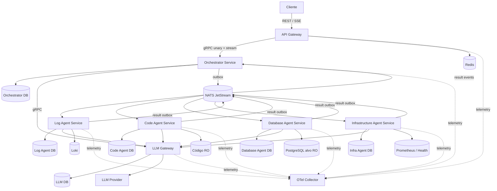
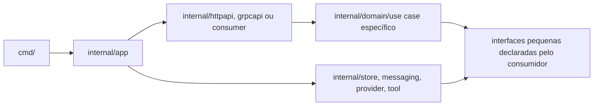
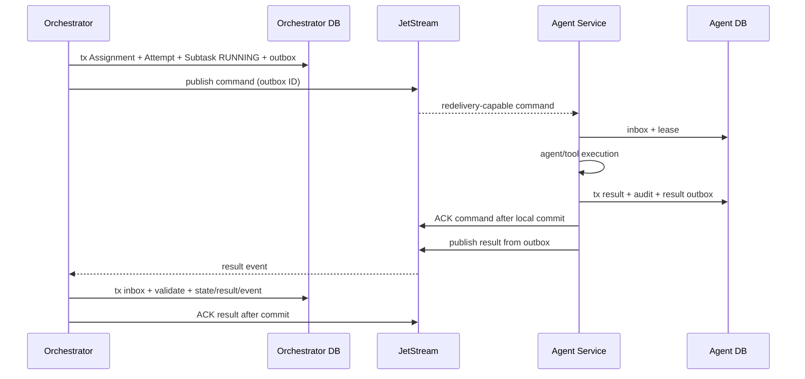
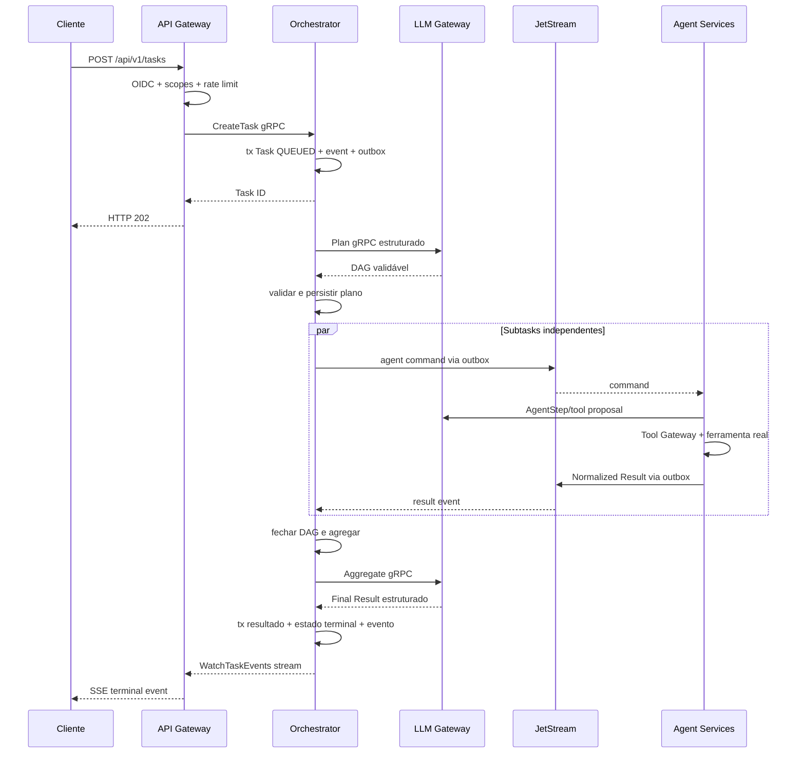

# Design técnico — AI Agent Orchestrator em microservices Go

## 1. Visão geral

O AI Agent Orchestrator será uma plataforma distribuída composta por **microservices independentes em Go**, organizados em um monorepo com `go.work`. Cada serviço possui seu próprio `go.mod`, entrypoint mínimo em `cmd/` e todo o código de aplicação encapsulado em seu próprio diretório `internal/`.

O Orchestrator é o único dono do agregado de execução (`Task`, plano, Subtasks, Attempts, eventos e resultado final). Os agentes especializados são serviços autônomos que consomem comandos, executam ferramentas somente leitura e publicam resultados normalizados. NATS JetStream conecta os workflows assíncronos; gRPC atende somente interações internas síncronas em que resposta imediata ou streaming é necessário; REST e SSE formam a API pública.

### 1.1 Decisões principais

| Tema | Decisão |
|---|---|
| Arquitetura | Microservices com deploy, escala e banco independentes |
| Organização Go | Monorepo, `go.work`, um módulo por serviço e `internal/` por módulo |
| API externa | REST/JSON v1 e SSE |
| RPC interno | gRPC com Protobuf e mTLS |
| Workflow assíncrono | NATS JetStream, entrega pelo menos uma vez |
| Consistência com broker | Transactional outbox/inbox em cada serviço persistente |
| Estado da execução | PostgreSQL exclusivo do Orchestrator |
| Estado dos agentes | PostgreSQL exclusivo por Agent Service |
| Rate limiting | Redis, usado pelo API Gateway |
| LLM | LLM Gateway dedicado, compatível com contratos OpenAI |
| Ferramentas | Locais ao Agent Service proprietário da fonte/credencial |
| Event stream | SSE no Gateway sobre gRPC server-streaming do Orchestrator |
| IDs | UUIDv7 |

### 1.2 Objetivos

- Demonstrar microservices reais sem banco compartilhado nem chamadas internas acopladas a tabelas alheias.
- Usar concorrência Go para executar trabalho útil: consumers, worker pools, ferramentas e agregação paralela.
- Preservar estados e resultados diante de crash, redelivery e duplicação.
- Isolar credenciais e superfície de rede por especialização de agente.
- Tornar clara a autoridade de cada decisão: Orchestrator coordena, Agent executa, Tool Gateway autoriza localmente e LLM apenas propõe.
- Permitir execução local com Docker Compose e evolução para um orquestrador de containers.

### 1.3 Não objetivos do MVP

- Ferramentas de escrita ou remediação automática.
- Comunicação livre agente-agente.
- Transações distribuídas 2PC.
- Service mesh, Kubernetes ou multi-região.
- Multi-tenancy forte ou billing.
- Execução de shell/código fornecido pelo usuário.
- Um microservice separado para cada classe interna sem necessidade operacional.

## 2. Serviços e ownership

### 2.1 Mapa de serviços



### 2.2 Responsabilidades e dados

| Serviço | Responsabilidade | Dados exclusivos | Escala |
|---|---|---|---|
| `api-gateway` | REST, SSE, OIDC, autorização de rota, validação HTTP, rate limit e request IDs | Nenhum estado de negócio | Horizontal, stateless |
| `orchestrator` | Task lifecycle, Planner, Scheduler, Agent Registry, DAG, retries, cancelamento e Aggregator | Tasks, planos, Subtasks, Attempts, assignments, resultados, eventos, outbox/inbox | Uma ou mais réplicas com claims no DB |
| `llm-gateway` | Providers, prompts estruturados, function calling, token budgets, retry e redaction | Chamadas LLM, reservas de budget, idempotência e auditoria | Horizontal |
| `log-agent` | Estratégia de logs e ferramentas Loki | Inbox, leases, Tool Calls, resultados locais e outbox | Horizontal por consumer group |
| `code-agent` | Estratégia de código e leitura segura do repositório | Inbox, leases, Tool Calls, resultados locais e outbox | Horizontal; volumes RO equivalentes |
| `database-agent` | Estratégia de banco, schema e SQL read-only | Inbox, leases, Tool Calls, resultados locais e outbox | Horizontal com credencial RO |
| `infrastructure-agent` | Estratégia de saúde e métricas | Inbox, leases, Tool Calls, resultados locais e outbox | Horizontal |

### 2.3 Regras de ownership

1. Somente o Orchestrator altera estados de Task/Subtask e aceita `Final_Result`.
2. Agent Services nunca acessam o banco do Orchestrator.
3. O Orchestrator nunca acessa bancos internos dos agentes.
4. Cada agente publica `Normalized_Result`; duplicatas são absorvidas pelo inbox do Orchestrator.
5. Ferramentas e credenciais de uma especialização ficam no respectivo Agent Service.
6. O API Gateway não consulta PostgreSQL; usa o contrato gRPC do Orchestrator.
7. O LLM Gateway não decide estado da Task e não executa ferramentas.
8. Uma implantação local pode usar um cluster PostgreSQL, porém com databases, users e grants separados por serviço.

## 3. Estrutura do monorepo e `internal` Go

### 3.1 Estrutura proposta

```text
go.work
Makefile

contracts/
  openapi/v1/orchestrator.yaml
  proto/orchestrator/v1/orchestrator.proto
  proto/llm/v1/llm.proto
  asyncapi/orchestrator.yaml
  jsonschema/plan/v1.json
  jsonschema/events/v1/
  jsonschema/tools/v1/

services/
  api-gateway/
    go.mod
    cmd/api-gateway/main.go
    internal/
      app/                 composition root e lifecycle
      config/              configuração tipada
      httpapi/             handlers REST e middleware
      sse/                 adaptação gRPC stream -> SSE
      auth/                OIDC, scopes e ownership metadata
      ratelimit/           Redis/GCRA
      orchestratorclient/  adapter gRPC
      observability/       slog e OpenTelemetry

  orchestrator/
    go.mod
    cmd/orchestrator/main.go
    internal/
      app/
      config/
      task/                agregado, estados e invariantes
      planner/             decomposição e validação do DAG
      scheduler/           readiness, fairness e dispatch
      registry/            capabilities e saúde dos agentes
      execution/           Attempts, retry, timeout e cancelamento
      aggregation/         Final Result e fallback determinístico
      grpcapi/              comandos, queries e event stream internos
      messaging/           contracts locais, consumers e publishers NATS
      store/postgres/      repositórios, inbox, outbox e migrations runner
      llmclient/            adapter gRPC para LLM Gateway
      observability/
      shutdown/

  llm-gateway/
    go.mod
    cmd/llm-gateway/main.go
    internal/
      app/
      config/
      grpcapi/
      gateway/             planning, agent step e aggregation
      provider/            adapters OpenAI-compatible
      schema/              validação das respostas estruturadas
      budget/              reservas atômicas de tokens/chamadas
      prompt/              composição e trust boundaries
      redaction/
      store/postgres/
      observability/
      shutdown/

  agents/
    go.mod
    internal/
      runtime/              consumer, worker pool, inbox/outbox e health comuns aos agentes

    log-agent/
      go.mod
      cmd/log-agent/main.go
      internal/tool/        conector Loki

    code-agent/
      go.mod
      cmd/code-agent/main.go
      internal/tool/        filesystem read-only

    database-agent/
      go.mod
      cmd/database-agent/main.go
      internal/tool/        PostgreSQL read-only

    infrastructure-agent/
      go.mod
      cmd/infrastructure-agent/main.go
      internal/tool/        health e Prometheus

infra/
  postgres/
  loki/
  otel/
  tempo/
  grafana/
  prometheus/

docs/
  ARCHITECTURE.md
  API.md
```

### 3.2 Regras obrigatórias do `internal`

- Cada `main.go` apenas cria o contexto do processo e chama o runtime ou `internal/app.Run`.
- Código de domínio, casos de uso e adapters fica sob o `internal/` do próprio módulo.
- Um serviço não importa o `internal/` de outro serviço.
- Os quatro Agent Services podem importar `services/agents/internal/runtime`, pois todos são descendentes do mesmo boundary Go e compartilham apenas mecânica operacional, não domínio nem Tools.
- Não haverá `pkg/`, `common/`, `shared/` ou `utils/` genérico no MVP.
- Contratos wire ficam no módulo `contracts`; código Protobuf é gerado em `contracts/gen/go`.
- Duplicação pequena de lógica específica é preferível a acoplamento de domínio entre serviços.
- Interfaces são declaradas no package consumidor e limitadas a fronteiras externas ou alternativas reais.

### 3.3 Direção interna de dependências

Cada serviço segue o mesmo fluxo simples, sem impor camadas artificiais:



`internal/app` é o composition root. Packages centrais não importam adapters concretos. Não há package intermediário cuja única função seja repassar chamadas.

## 4. Contratos entre serviços

### 4.1 Quando usar gRPC

O uso de gRPC passa a ser justificado pelas fronteiras de microservices:

- API Gateway → Orchestrator: criar, consultar, cancelar, listar agentes e acompanhar eventos.
- Orchestrator → LLM Gateway: planejar e agregar.
- Agent Services → LLM Gateway: executar `AgentStep` estruturado e limitado.
- Health checks internos conforme o protocolo padrão gRPC.

O workflow de execução de Subtasks não usa gRPC, pois deve sobreviver a indisponibilidade e suportar backlog; ele usa JetStream.

### 4.2 API interna do Orchestrator

```protobuf
service OrchestratorService {
  rpc CreateTask(CreateTaskRequest) returns (CreateTaskResponse);
  rpc GetTask(GetTaskRequest) returns (GetTaskResponse);
  rpc CancelTask(CancelTaskRequest) returns (CancelTaskResponse);
  rpc ListAgents(ListAgentsRequest) returns (ListAgentsResponse);
  rpc WatchTaskEvents(WatchTaskEventsRequest) returns (stream TaskEvent);
}
```

O Gateway envia metadata interna assinada com `principal_id`, scopes, request ID e trace context. O bearer token externo não atravessa a rede interna.

### 4.3 API interna do LLM Gateway

```protobuf
service LLMGatewayService {
  rpc OpenTaskBudget(OpenTaskBudgetRequest) returns (OpenTaskBudgetResponse);
  rpc Plan(PlanRequest) returns (PlanResponse);
  rpc AgentStep(AgentStepRequest) returns (AgentStepResponse);
  rpc Aggregate(AggregateRequest) returns (AggregateResponse);
}
```

Cada operação exige chave idempotente, deadline, Task ID, finalidade, schema version e budget grant. O LLM Gateway reserva consumo atomicamente antes da chamada externa.

### 4.4 Compatibilidade

- Protobuf segue additive evolution; field numbers nunca são reutilizados.
- Mensagens NATS e eventos SSE possuem `schema_version` explícita.
- Consumers aceitam a versão atual e a anterior durante rollout.
- Mudança incompatível cria novo subject/RPC package `v2`.
- OpenAPI e AsyncAPI são validados em CI.

## 5. Mensageria e semântica distribuída

### 5.1 Escolha do backbone

Escala de 1 a 5 com os pesos aprovados:

| Critério | Peso | Redis Streams | NATS JetStream | RabbitMQ |
|---|---:|---:|---:|---:|
| Durabilidade, ack, redelivery e crash recovery | 25% | 4 | 5 | 5 |
| Operação local | 20% | 5 | 4 | 3 |
| Consumer groups, backpressure, retry e DLQ | 20% | 4 | 5 | 5 |
| Escala, throughput e latência | 15% | 3 | 5 | 4 |
| Observabilidade | 10% | 3 | 4 | 4 |
| Cliente Go e maturidade | 10% | 4 | 5 | 4 |
| **Pontuação** | **100%** | **3,95** | **4,70** | **4,25** |

**Decisão:** NATS JetStream. Redis permanece dedicado a rate limiting/cache. RabbitMQ é robusto, porém traz maior custo operacional para roteamento simples por capability.

### 5.2 Streams e subjects

| Stream | Subjects | Política |
|---|---|---|
| `ORCH_COMMANDS` | `commands.agent.*.execute.v1`, `commands.agent.*.*.cancel.v1` | Work queue para execute; consumer durável por instância para cancel direcionado |
| `ORCH_RESULTS` | `results.agent.*.started.v1`, `results.agent.*.completed.v1`, `results.agent.*.failed.v1` | Consumer durável do Orchestrator |
| `ORCH_CONTROL` | `agents.heartbeat.v1`, `tasks.events.notify.v1`, `llm.usage.v1` | Retenção limitada |
| `ORCH_DLQ` | `dlq.>` | Retenção por tempo e tamanho |

Cada Agent Service possui consumer durável próprio para seu subject; réplicas do mesmo agente compartilham o consumer.

### 5.3 Work envelope

```json
{
  "schema_version": 1,
  "message_id": "uuidv7-outbox",
  "task_id": "uuidv7",
  "subtask_id": "uuidv7",
  "attempt_id": "uuidv7",
  "assignment_id": "uuidv7",
  "capability": "logs.analyze",
  "deadline": "2026-01-01T00:00:00Z",
  "execution_grant": "signed-short-lived-token",
  "traceparent": "...",
  "payload": {
    "objective": "...",
    "dependency_result_refs": []
  }
}
```

O envelope não contém bearer token, credenciais de ferramentas ou outputs grandes. `execution_grant` é assinado pelo Orchestrator, possui audience do Agent Service, scopes, Tools permitidas, parcela de budget reservada atomicamente antes do dispatch e expiração. A soma das parcelas ativas nunca ultrapassa o budget global da Task; saldo não usado volta ao Orchestrator por result event.

### 5.4 Outbox/inbox por serviço

**Orchestrator:** persiste Assignment, Attempt, transição de Subtask e comando de outbox na mesma transação. O publisher envia usando `Nats-Msg-Id=outbox.id` e marca a publicação após PubAck.

**Agent Service:** ao receber comando, persiste inbox e lease compartilhados por todas as réplicas daquele tipo de agente. Durante execução longa, renova o lease local e envia `InProgress` ao JetStream dentro de intervalo menor que `AckWait`. Depois da execução, persiste `Normalized_Result`, projeções seguras das Tool Calls e result outbox na mesma transação; somente então envia ACK do comando. Seu publisher entrega o resultado e as projeções auditáveis ao JetStream.

**Orchestrator result consumer:** persiste inbox, valida Attempt/lease/version, incorpora as projeções em `tool_call_audit` e aplica resultado em uma transação. Duplicata concluída recebe ACK sem nova transição.



Essa estratégia não oferece exactly-once delivery; oferece **at-least-once com efeito lógico idempotente**.

### 5.5 Retry e DLQ

- Falha transitória de transporte: NAK com backoff e jitter.
- Falha transitória de negócio: novo Attempt criado pelo Orchestrator, com novo Attempt ID.
- Falha permanente/schema/policy: result event de falha e ACK do comando.
- Mensagem impossível de desserializar: registro seguro em DLQ e ACK da original.
- Após `MaxDeliver`, um reconciler persiste `Dead_Letter_Record` e fecha o Attempt de forma recuperável.
- Retry de entrega e retry de negócio são métricas distintas.

## 6. Persistência e modelo de dados

### 6.1 Orchestrator DB

| Tabela | Conteúdo | Invariantes principais |
|---|---|---|
| `tasks` | Owner, descrição, status, versão, deadline, budgets e cancelamento | UUIDv7 PK; optimistic version |
| `idempotency_records` | Principal, key hash, request fingerprint, Task e resposta | UNIQUE `(principal,key_hash)` |
| `execution_plans` | Schema version, hash e metadata do Planner | UNIQUE `task_id` |
| `subtasks` | Capability, estado, prioridade, timeout e limits | FK Task; índice de scheduling |
| `subtask_dependencies` | predecessor, successor e required | PK composta; sem autorreferência |
| `attempts` | número, status, deadline, lease lógico e erro | UNIQUE `(subtask_id,number)` |
| `agent_assignments` | Agent type/instance/version e Attempt | UNIQUE `attempt_id` |
| `normalized_results` | resultado aceito, referências e hash | UNIQUE `attempt_id` |
| `tool_call_audit` | projeção segura de Tool Call ID, Tool/version, Agent, status, duração, truncamento e erro | UNIQUE `tool_call_id`; sem payload sensível |
| `final_results` | resumo, conclusões, referências, falhas e limitações | UNIQUE `task_id` |
| `task_events` | Event ID monotônico, type, version e payload | UNIQUE `(task_id,event_id)` |
| `agent_registry` | capabilities, version e último heartbeat | projeção reconstruível |
| `outbox_messages` | subject, payload, headers e publish state | índice parcial pendente |
| `inbox_messages` | consumer, message ID e completion state | UNIQUE `(consumer,message_id)` |
| `dead_letter_records` | origem, classificação e payload reduzido | append-only |
| `audit_records` | decisões e identidades redigidas | append-only |

`event_id` é alocado ao incrementar `tasks.next_event_id` na mesma transação do evento. Nenhuma transação fica aberta durante RPC, Tool Call ou publish.

### 6.2 Agent DB

Cada Agent Service tem as mesmas tabelas estruturais, em database próprio:

- `inbox_messages` e leases;
- `executions` por Attempt;
- `tool_calls` e resultados redigidos;
- `normalized_results` locais;
- `outbox_messages` de resultado;
- `audit_records`;
- `dead_letter_records` locais.

O resultado local é evidência de execução; somente a cópia aceita pelo Orchestrator compõe o estado oficial da Task.

### 6.3 LLM DB

- `task_budgets` com limite, reservado e consumido;
- `llm_calls` com idempotency key, purpose, provider/model, tokens, latência e estado;
- `response_cache` apenas quando a política permitir;
- `outbox_messages` para usage/security events;
- `audit_records` sem prompts sensíveis por padrão.

### 6.4 Database-per-service

No Compose, um container PostgreSQL pode hospedar vários databases por economia local. Cada serviço recebe uma role sem permissão de conectar ou consultar database alheio. Em produção, os databases podem ser movidos para instâncias separadas sem mudança de contrato.

Migrações pertencem ao serviço e são executadas antes de sua readiness. Mudanças seguem expand/migrate/contract.

## 7. Fluxo da Task

### 7.1 Fluxo principal



### 7.2 Planejamento e DAG

O Planner pertence ao Orchestrator. Ele solicita ao LLM Gateway um plano estruturado, depois valida localmente:

1. JSON Schema e versão;
2. Subtask IDs únicos e limits;
3. capabilities registradas;
4. dependências existentes e sem autorreferência;
5. aciclicidade por ordenação topológica.

O LLM Gateway não persiste o plano oficial. Plano inválido nunca chega ao Scheduler.

### 7.3 Agent Registry

Agent Services publicam heartbeat assinado contendo tipo, versão, capabilities, Tools e capacidade disponível. O Orchestrator mantém uma projeção durável e considera instâncias elegíveis somente dentro do TTL. A seleção é determinística por capability, policy, saúde, versão e carga anunciada.

O comando é endereçado ao **Agent Service selecionado deterministicamente** por capability, policy e versão; réplicas desse mesmo agente representam a mesma implementação lógica, e o JetStream distribui a entrega operacional entre elas. Ao obter o lease, a réplica publica `results.agent.<type>.started.v1` por outbox com seu `instance_id`. O Orchestrator então completa `agent_assignments` com a instância observada e pode direcionar cancelamento ao subject exclusivo dessa réplica.

### 7.4 Scheduler e concorrência distribuída

O Scheduler usa Deficit Round Robin entre Tasks e aplica:

- limite global de Attempts ativos;
- limite por Task;
- limite por capability;
- dependências obrigatórias;
- prioridade estável por `priority`, `ready_at` e Subtask ID;
- compare-and-swap por versão ao fazer dispatch.

Réplicas do Orchestrator disputam claims com `FOR UPDATE SKIP LOCKED`; apenas uma cria o Assignment/outbox. Uma Task ruidosa não monopoliza slots.

### 7.5 Falha parcial

Resultado de um ramo independente é mantido mesmo quando outro falha. Descendentes obrigatórios do ramo falho tornam-se `SKIPPED`. Ao fechar o DAG:

- todos os resultados requeridos: `COMPLETED`;
- pelo menos um resultado útil e alguma falha: `PARTIALLY_COMPLETED`;
- nenhum resultado útil: `FAILED`.

### 7.6 Cancelamento

1. Gateway autoriza e chama `CancelTask`.
2. Orchestrator persiste `cancel_requested_at`, evento e cancel outbox na mesma transação.
3. Scheduler bloqueia novos dispatches.
4. Para Attempts com `instance_id` conhecido, o publisher envia `commands.agent.<type>.<instance>.cancel.v1`; para dispatch ainda não iniciado, a própria versão/cancel flag do Attempt invalida qualquer resultado posterior.
5. Cada réplica mantém consumer durável em seu subject exclusivo e um mapa concorrente `Attempt_ID -> CancelFunc`; ao consumir o cancel, sinaliza o contexto local e confirma somente após registrar o cancelamento.
6. Tool/LLM calls recebem cancelamento pelo contexto; deadline e expiração do execution grant são a barreira adicional caso a mensagem de controle atrase.
7. Após grace period, Orchestrator fecha a Task como `CANCELLED`.
8. Resultados posteriores viram `Late_Result` de auditoria e não alteram estado terminal.

## 8. Concorrência Go dentro de cada serviço

Microservices não substituem concorrência local; cada processo usa goroutines e channels com ownership explícito.

### 8.1 API Gateway

- servidor HTTP e pool de conexões gRPC;
- uma goroutine por SSE conectada, com buffer limitado;
- cancelamento HTTP propagado ao gRPC stream;
- limite global e por Principal de streams.

### 8.2 Orchestrator

- pool limitado para planning;
- pool de scheduling/reconciliation;
- pull consumer limitado para results;
- outbox publisher com batch e in-flight limits;
- pool separado para aggregation;
- nenhuma chamada LLM dentro de transação.

### 8.3 Agent Service

Cada agente possui:

- pull consumer JetStream com `MaxAckPending` alinhado ao pool;
- worker pool de execução;
- pools separados por Tool quando latências/limites diferirem;
- control consumer para cancelamento;
- outbox publisher;
- mapa protegido de execuções em voo.

```go
// Pseudocódigo de ownership, não implementação.
type Runtime struct {
    jobs   chan Work
    cancel map[uuid.UUID]context.CancelFunc
    wg     sync.WaitGroup
}

func (r *Runtime) worker(ctx context.Context) {
    defer r.wg.Done()
    defer recoverAndReportPanic()
    for {
        select {
        case <-ctx.Done():
            return
        case work, ok := <-r.jobs:
            if !ok {
                return
            }
            r.execute(withEffectiveDeadline(ctx, work))
        }
    }
}
```

O runtime é o único dono que fecha `jobs`; consumers não fecham channels. Todo send/receive bloqueante seleciona também `ctx.Done()`.

### 8.4 Context hierarchy

```text
process context
└── message delivery context
    └── Attempt context (deadline do comando)
        ├── AgentStep gRPC context
        ├── Tool Call context
        └── result persistence/publish context limitado
```

Persistir resultado após a operação usa contexto curto derivado do processo, sem ignorar que o Attempt foi cancelado; isso permite registrar a falha/cancelamento com segurança.

### 8.5 Retry

```text
next_delay = min(cap, base * 2^attempt) + uniform(0, jitter)
```

- somente operações idempotentes e falhas transitórias;
- `Retry-After` válido do provider tem precedência;
- auth/schema/policy/input são falhas permanentes;
- delivery retry não incrementa Attempt de negócio;
- todos os timers observam contexto.

### 8.6 Backpressure

1. Gateway rejeita admissão com `503 + Retry-After`.
2. Redis/GCRA limita taxa por identidade/origem/operação.
3. Scheduler respeita slots globais, por Task e capability.
4. Streams limitam mensagens, bytes e idade.
5. Pull consumers limitam batch e `MaxAckPending`.
6. Channels locais são bounded.
7. LLM Gateway recusa quando pool/budget estiver saturado.
8. SSE encerra cliente lento com cursor retomável.

### 8.7 Graceful shutdown

Em cada serviço:

1. readiness passa a false;
2. para de aceitar/claimar trabalho;
3. cancela ou drena segundo policy;
4. persiste trabalho recuperável e expira leases quando necessário;
5. para producers e fecha channels pelos owners;
6. aguarda goroutines com `WaitGroup`;
7. fecha NATS/gRPC/HTTP;
8. faz flush OTel;
9. fecha Redis/PostgreSQL.

## 9. Agentes e Tool Gateways locais

Agentes não são somente prompts. Cada Agent Service contém estratégia, policy e Tool Gateway próprios, reduzindo blast radius.

### 9.1 Pipeline comum

1. validar Work Envelope e execution grant;
2. validar Tool Call por JSON Schema;
3. canonicalizar argumentos;
4. intersectar grant, capabilities do agente e Tool Policy local;
5. reservar budget no Agent DB;
6. persistir auditoria antes da execução;
7. executar com timeout/output/resource limits;
8. reduzir e redigir Tool Output;
9. persistir resultado;
10. tratar output como dados não confiáveis.

Repetição compatível de Tool Call ID retorna resultado existente. Reutilização com argumentos diferentes gera conflito.

### 9.2 Log Agent

Fonte do demo: Loki.

- Tools: `search_logs`, `filter_logs`, `aggregate_errors`;
- datasource, tenants, labels e campos allowlisted;
- janela temporal, séries, linhas e bytes limitados;
- builder/subconjunto validado de LogQL;
- referências incluem fonte lógica, intervalo, filtro redigido e Tool Call ID.

### 9.3 Code Agent

Fonte do demo: volume de código read-only.

- Tools: `search_code`, `read_file`, `inspect_dependencies`;
- roots lógicas, extensões e manifests allowlisted;
- `Clean`, caminho absoluto, `EvalSymlinks` e contenção após canonicalização;
- container non-root, filesystem read-only, capabilities removidas e `no-new-privileges`;
- limites de arquivos, linhas, resultados e bytes;
- sem shell, build, plugins ou execução;
- referências incluem caminho relativo, linhas e hash.

### 9.4 Database Agent

Fonte do demo: PostgreSQL separado com role somente leitura.

- Tools: `inspect_schema`, `execute_readonly_query`, `analyze_slow_queries`;
- parser PostgreSQL real e validação por AST, nunca regex;
- uma instrução `SELECT`, `WITH ... SELECT` ou `EXPLAIN` sem `ANALYZE`;
- bloqueio de DDL/DML, `COPY`, locks, CTE mutável, múltiplos statements e funções não allowlisted;
- `BEGIN READ ONLY`, `statement_timeout`, row/byte limits;
- startup falha se a role possuir escrita.

### 9.5 Infrastructure Agent

Fontes do demo: Prometheus e endpoints de health.

- Tools: `inspect_service`, `inspect_health`, `inspect_metrics`;
- alvo lógico mapeado para endpoint configurado; sem URL livre;
- DNS e todos os IPs validados antes de conectar;
- dial no IP validado com Host/SNI esperado;
- redirects desabilitados ou revalidados;
- metadata endpoints, redes e portas bloqueados salvo allowlist;
- somente GET/query, timeout e output cap.

## 10. LLM Gateway

### 10.1 Responsabilidade

- selecionar provider/model configurado;
- construir prompts com trust boundaries;
- validar structured output/function calling;
- reservar e contabilizar budget;
- aplicar timeout, retry e circuit breaker;
- emitir métricas de tokens/chamadas;
- redigir inputs e outputs segundo source policy;
- fornecer fallback de erro classificado, não decisão de domínio.

### 10.2 Budget distribuído

Ao iniciar uma Task, o Orchestrator chama `OpenTaskBudget` idempotentemente. O LLM Gateway mantém o hard limit atômico por Task. Plan, Agent Steps e Aggregate reservam tokens máximos antes da chamada; a diferença é liberada após usage real. Usage events retornam ao Orchestrator via outbox/NATS para projeção e eventos de 80%.

Isso evita overshoot quando vários Agent Services chamam o LLM concorrentemente.

### 10.3 Prompt injection

- Task description, logs, SQL rows, código, métricas e Tool Output são dados não confiáveis.
- System policy, schemas e data blocks são separados.
- O modelo recebe nomes/capabilities de Tools, nunca credenciais.
- Tool Call é proposta; Agent Tool Gateway decide.
- Execution grant não pode ser ampliado por output do modelo.
- Source policy remove campos proibidos antes do envio externo.
- Loops possuem limite de passos, tokens, tempo e Tool Calls.
- Evento de segurança é redigido e fail-closed quando policy não puder ser aplicada.

## 11. API pública e SSE

### 11.1 Endpoints

- `POST /api/v1/tasks`
- `GET /api/v1/tasks/{id}`
- `POST /api/v1/tasks/{id}/cancel`
- `GET /api/v1/tasks/{id}/events`
- `GET /api/v1/agents`
- `GET /api/v1/health`

O Gateway traduz REST para gRPC sem duplicar regras de domínio. `CreateTask` retorna apenas depois do commit no Orchestrator DB.

### 11.2 SSE

SSE permanece preferível ao WebSocket porque o fluxo público é unidirecional. O Gateway abre `WatchTaskEvents` com cursor e converte cada mensagem para:

```text
id: 42
event: subtask.completed
data: {"schema_version":1,"task_id":"...","subtask_id":"..."}
```

O Orchestrator:

1. autoriza Owner/admin a partir da metadata assinada;
2. lê eventos persistidos após o cursor;
3. acompanha novas notificações;
4. envia em ordem estritamente crescente;
5. retorna cursor expirado quando anterior à retenção.

O Gateway envia heartbeat a cada 15 s, limita o buffer por conexão, encerra cliente lento com último cursor seguro e fecha a conexão em até 30 s após expiração da credencial.

## 12. Segurança entre microservices

### 12.1 Identidade externa

- OIDC JWT validado no Gateway: assinatura, issuer, audience, algoritmo e tempo.
- Scopes: `tasks:create`, `tasks:read`, `tasks:cancel`, `agents:read` e scopes de Tools.
- Owner/admin é revalidado no Orchestrator.
- Task alheia retorna `404`.

### 12.2 Identidade interna

- mTLS entre serviços, com identidade por certificado/SPIFFE-like URI configurada.
- Network policies permitem apenas dependências necessárias.
- Metadata interna é assinada, possui audience, expiração, Principal e scopes.
- NATS usa accounts/credentials por serviço e subject permissions mínimas.
- Execution grants têm curta duração e são específicos de Agent/Attempt.

### 12.3 Segredos

- API Gateway: OIDC e Redis.
- Orchestrator: DB, NATS, chave de assinatura de grants e LLM Gateway client identity.
- LLM Gateway: somente ele possui API keys de providers.
- Cada Agent Service possui somente credenciais de sua fonte e do NATS/LLM necessários.
- Segredos entram por Docker/Kubernetes secrets ou provider externo; nunca no Git, log, evento ou mensagem.

### 12.4 Rate limiting

Redis usa GCRA via script Lua atômico por Principal, origem e operação. Se Redis falhar:

- criação e novo SSE retornam `503`;
- GET/cancel usam limite emergencial local;
- Gateway fica not-ready;
- Tasks existentes continuam nos serviços internos.

### 12.5 Blast radius

| Comprometimento | O que o serviço consegue acessar |
|---|---|
| API Gateway | APIs internas autorizadas e Redis; sem DB/LLM/tool credentials |
| Orchestrator | estado de execução e comandos; sem dados-fonte diretos |
| LLM Gateway | provider e conteúdo já reduzido; sem credenciais de Tools |
| Log Agent | somente Loki/tenant allowlisted |
| Code Agent | somente roots montadas read-only |
| Database Agent | somente DBs/objetos read-only allowlisted |
| Infrastructure Agent | somente endpoints/metrics allowlisted |

## 13. Observabilidade distribuída

### 13.1 Trace propagation

- W3C `traceparent` em HTTP, gRPC metadata e NATS headers.
- Spans de consumers usam links ao producer quando apropriado.
- Trace abrange Gateway → Orchestrator → JetStream → Agent → LLM/Tool → result → Aggregator.

### 13.2 Logs estruturados

Todos os serviços usam `log/slog` JSON com:

```text
service, version, instance_id, request_id, correlation_id, trace_id,
task_id, subtask_id, attempt_id, agent_execution_id, tool_call_id,
message_id, operation, duration_ms, result, error_code, retry_number
```

`correlation_id` é o Task ID quando disponível; `agent_execution_id` é o Attempt ID. IDs ficam em logs/traces, não em labels de métricas.

### 13.3 Métricas

- Gateway: requests, rate limit, SSE connections e slow consumers.
- Orchestrator: Tasks por status, DAG duration, scheduler slots, retries, outbox age e partial failures.
- Agents: workers ativos, queue depth, Tool Calls, truncamentos, timeouts e cancels.
- LLM Gateway: calls, tokens, budget, latency e provider errors.
- NATS: pending, redelivery, ack latency e DLQ.
- PostgreSQL: pool usage e transaction latency por serviço.

Labels são fechadas: serviço, operação, status, agent type, tool name e error class. Nunca Task ID, Principal, query, URL ou path.

### 13.4 Stack local

OTel Collector recebe OTLP; Prometheus armazena métricas; Tempo traces; Loki logs; Grafana visualiza. Export buffers são limitados e falha de telemetria não bloqueia o workflow.

## 14. Health e disponibilidade

Cada serviço expõe liveness e readiness separadas.

- Gateway readiness: Redis, Orchestrator gRPC e configuração OIDC.
- Orchestrator readiness: DB migrado, JetStream e LLM Gateway para novas Tasks.
- LLM Gateway readiness: DB, provider config e secrets; provider remoto pode ser degraded.
- Agent readiness: DB, JetStream, LLM Gateway e fonte obrigatória segura.

O endpoint público agrega códigos lógicos, sem hosts, credentials ou payloads internos. Falha de um Agent torna a capability indisponível; outras capabilities podem continuar.

## 15. Testes

### 15.1 Por serviço

- unit tests do domínio/caso de uso;
- testes de handlers/consumers sem rede quando apropriado;
- testes de configuração e redaction;
- `go test`, `go vet`, `gofmt` e `go test -race` em cada módulo.

### 15.2 Contratos

- Buf/protobuf breaking checks;
- OpenAPI request/response;
- AsyncAPI e JSON Schema para mensagens;
- consumer-driven contract tests entre Gateway/Orchestrator, Orchestrator/LLM e Orchestrator/Agents;
- compatibilidade atual/anterior em rollout.

### 15.3 Integração

Testcontainers com versões fixas para PostgreSQL, Redis e NATS. Loki e Prometheus reais quando o teste exercitar seus protocolos.

Cenários principais:

- HTTP → gRPC → commit → 202;
- outbox publish e inbox consume;
- crash antes/depois de PubAck;
- Agent crash após Tool Call e antes do result publish;
- redelivery em duas réplicas;
- cancelamento durante Tool/LLM call;
- SSE replay e backpressure;
- isolamento de databases/credentials;
- DLQ e recuperação.

### 15.4 Concorrência e propriedades

| Propriedade | Verificação |
|---|---|
| Estado terminal absorvente | nenhum result tardio muda a Task |
| Uma transição por versão | CAS concorrente aceita no máximo uma |
| DAG sempre acíclico | topological sort inclui todos os nós |
| Dependência precede execução | sucessor não é dispatched antes das obrigatórias |
| Fairness | Task ruidosa não bloqueia progresso das demais |
| Limites respeitados | workers, channels, MaxAckPending e budgets nunca excedem config |
| Idempotência HTTP | chave/fingerprint igual produz uma Task |
| Idempotência de comando | redelivery produz um efeito local confirmado |
| Idempotência de resultado | Orchestrator aceita no máximo um resultado por Attempt |
| Outbox eventual | commit gera publish ou DLQ, nunca perda silenciosa |
| Tool policy monotônica | reduzir grants não aumenta Tool Calls aceitas |
| SQL rejeitado | zero query I/O para AST proibida |
| Path seguro | todo caminho aceito permanece dentro da root |
| Cancelamento | goroutines terminam no limite sem leak |
| Fallback | mesmas entradas produzem resultado determinístico |

Fuzzing cobre DAG, SQL, path canonicalization, envelopes e state transitions. Relógio e random source são injetáveis.

## 16. Defaults configuráveis

São valores iniciais, não requisitos imutáveis:

| Limite | Default |
|---|---:|
| Retenção de Tasks/Eventos | 30 dias |
| Idempotency key | 24 h |
| Subtasks por Task | 32 |
| Attempts ativos globais | 100 |
| Concorrência por Task | 4 |
| Workers por réplica de Agent | 8 |
| Channel local por pool | 64 |
| Task timeout | 10 min |
| Subtask timeout | 2 min |
| Tool timeout | 30 s |
| LLM timeout | 45 s |
| Business Attempts | 3 |
| JetStream MaxDeliver | 5 |
| Tool Calls por Task | 20 |
| Agent steps por Subtask | 5 |
| LLM budget por Task | 100 mil tokens |
| Tool output | 1 MiB |
| SSE buffer | 128 eventos |
| SSE heartbeat | 15 s |
| Shutdown grace | 30 s |
| Agent heartbeat TTL | 30 s |

A calibração usa load tests, idade da outbox, redelivery, p95/p99, saturação de pools e custo do LLM.

## 17. ADRs

### ADR-001 — Microservices com domínio central de orquestração

**Escolha:** Gateway, Orchestrator, LLM Gateway e quatro Agent Services independentes.  
**Motivo:** isolamento de credenciais/fontes, escala por capability e demonstração real de sistemas distribuídos.  
**Rejeitado:** monólito modular, por não atender à decisão atual de arquitetura; microservice por componente interno, por granularidade excessiva.

### ADR-002 — `internal/` por serviço

**Escolha:** um módulo Go por serviço; toda implementação não pública sob o `internal/` desse módulo.  
**Motivo:** fronteira reforçada pelo compilador e ownership claro.  
**Rejeitado:** módulo compartilhado de domínio e package `common`, que criariam distributed monolith.

### ADR-003 — Orchestrator como único dono da Task

**Escolha:** estados da execução permanecem em um único bounded context.  
**Motivo:** elimina transação distribuída para cada transição.  
**Rejeitado:** Task Service separado do Scheduler, que exigiria saga para invariantes básicas.

### ADR-004 — NATS JetStream

**Escolha:** commands/results assíncronos at-least-once.  
**Rejeitados:** gRPC para execução longa; Redis Streams por acúmulo de papéis; RabbitMQ por custo operacional maior no cenário.

### ADR-005 — Outbox/inbox local em cada serviço

**Escolha:** nenhuma escrita de DB e publish é tratada como operação atômica direta.  
**Rejeitado:** dual write e 2PC.

### ADR-006 — gRPC apenas para request/response interno

**Escolha:** Gateway↔Orchestrator e chamadas ao LLM Gateway.  
**Rejeitado:** gRPC para dispatch de Agent, pois perderia backlog e redelivery durável.

### ADR-007 — Tool Gateway dentro de cada Agent

**Escolha:** policy comum como contrato, implementação e credenciais locais por agente.  
**Motivo:** menor blast radius e menor serviço central privilegiado.  
**Rejeitado:** Tool Service único com acesso a todas as fontes.

### ADR-008 — SSE público

**Escolha:** SSE sobre gRPC server-streaming.  
**Rejeitado:** WebSocket sem necessidade bidirecional.

## 18. Riscos e mitigação

| Risco | Mitigação |
|---|---|
| Complexidade operacional de sete serviços | Compose, templates consistentes, health checks e observabilidade desde o início |
| Distributed monolith via libs compartilhadas | `internal/` por módulo e contratos versionados |
| Inconsistência eventual | Orchestrator como owner, outbox/inbox, reconcilers e estados explícitos |
| Duplicação at-least-once | IDs estáveis, unique constraints, inbox e CAS |
| Agent indisponível | health TTL, backlog durável e falha parcial |
| LLM Gateway como gargalo | escala horizontal, budgets atômicos e pools limitados |
| NATS indisponível | outbox durável e publish após recuperação |
| Vazamento entre serviços | mTLS, subject ACL, database roles e secrets por serviço |
| Goroutine leak | ownership, context, WaitGroup, race/leak tests |
| Prompt injection | trust boundaries e Tool Policy local determinística |
| SSRF/path/SQL | defesas específicas em profundidade por Agent Service |
| Rollout incompatível | versionamento e janela atual/anterior |
| Métricas de alta cardinalidade | IDs somente em logs/traces |

## 19. Roadmap incremental

### Slice 1 — Plataforma distribuída mínima

- `go.work`, módulos `api-gateway` e `orchestrator`, cada um com `internal/`;
- contracts OpenAPI/Protobuf;
- OIDC local, create/get/cancel/health;
- Orchestrator DB, migrations, idempotência e Task events;
- SSE via gRPC stream;
- Docker Compose e OTel básico.

**Demonstração:** dois serviços reais, persistência e streaming.

### Slice 2 — Mensageria e primeiro Agent Service

- NATS JetStream;
- outbox/inbox e DLQ;
- Scheduler, DAG, worker limits e retries;
- `code-agent` com módulo/DB/`internal/` próprios e volume RO;
- testes de redelivery e race.

**Demonstração:** Subtasks paralelas atravessam processos e sobrevivem a crash.

### Slice 3 — LLM Gateway

- módulo/DB/`internal/` próprios;
- planning, AgentStep, aggregation e token budgets;
- structured outputs, provider compatible e fallback;
- mTLS e trace propagation gRPC.

**Demonstração:** planejamento e tool calling reais sem expor provider key aos agentes.

### Slice 4 — Demais agentes

- `log-agent` + Loki;
- `database-agent` + role/AST read-only;
- `infrastructure-agent` + Prometheus/health;
- Agent Registry e partial completion.

**Demonstração:** investigação de HTTP 500 com quatro capabilities.

### Slice 5 — Hardening distribuído

- execution grants e NATS subject ACLs;
- Redis/GCRA;
- cancellation propagation e graceful shutdown;
- reconcilers, leases e chaos/failure tests;
- dashboards e alertas.

**Marco:** MVP técnico completo.

### Slice 6 — Portfólio e entrega

- Dockerfiles non-root por serviço;
- Compose completo com profiles;
- CI por módulo, contract checks e race;
- README, ARCHITECTURE, ADRs, OpenAPI/AsyncAPI e exemplos;
- cenário demonstrável e gravação de execução.

### Pós-MVP

- Kubernetes e autoscaling por consumer lag;
- HA PostgreSQL/NATS;
- Task search paginada;
- human-in-the-loop;
- multi-tenancy forte;
- novos Agent Services;
- ferramentas de escrita em sandbox dedicado.

## 20. Rastreabilidade

| Requisitos | Design |
|---|---|
| 1–2 | Gateway, Orchestrator gRPC, Task DB e state machine |
| 3–4 | Planner, DAG, Scheduler e Agent Registry |
| 5–8 | quatro Agent Services e Tool Gateways locais |
| 9 | execution grants, policies e auditoria local |
| 10–13 | worker pools, JetStream, fairness, retry, cancel e partial failure |
| 14–15 | Aggregator, Task Events, gRPC stream e SSE |
| 16 | database-per-service, outbox/inbox, leases e reconcilers |
| 17–20 | OIDC, mTLS, scopes, Redis, secrets e prompt injection |
| 21 | LLM Gateway dedicado |
| 22 | JetStream, ACK, redelivery e DLQ |
| 23–25 | OTel, health e shutdown por serviço |
| 26 | módulos, migrations, Dockerfiles e Compose |
| 27 | unit, contract, integration, failure, property e race tests |
| 28 | `internal/` por serviço, context ownership e imports acíclicos |

## 21. Critérios de evolução

- Um componente só vira novo microservice se precisar de escala, isolamento, dados ou ciclo de deploy próprios.
- Nenhum novo serviço recebe acesso direto ao database de outro.
- Toda nova integração síncrona precisa de timeout, retry classificado, circuit breaker e justificativa.
- Todo workflow que precise sobreviver ao caller usa mensagem durável, não RPC síncrono.
- Contratos incompatíveis exigem nova versão e migração gradual.
- Ferramentas perigosas exigirão sandbox e aprovação humana antes de entrar no catálogo.

Esta arquitetura mantém a Task consistente em um bounded context, distribui execução e risco entre serviços especializados e usa o mecanismo `internal` do Go para impedir acoplamento acidental entre implementações.